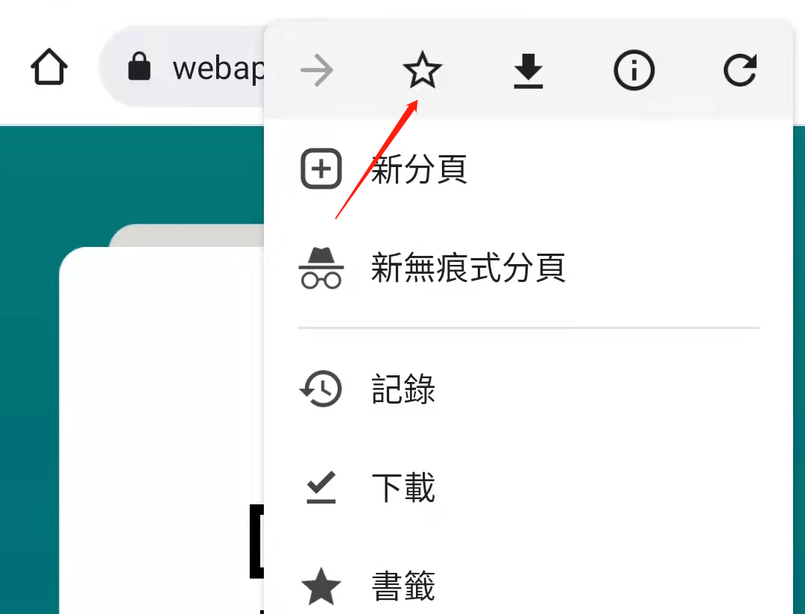
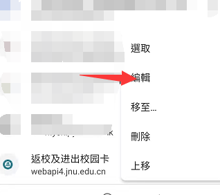
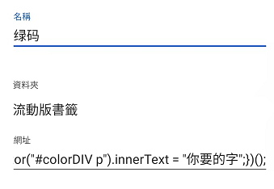
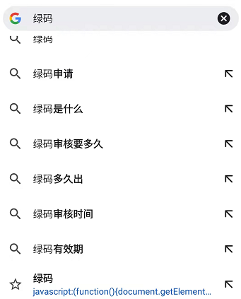
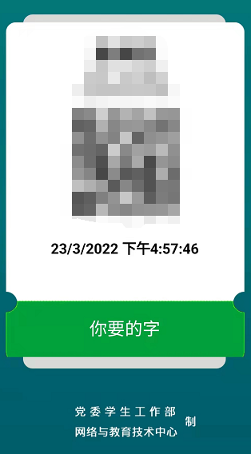

# 本项目仅供学术用途，用来研究 js 和 html 之间的交互，以及如何在手机上使用 js

如果你知道如何在安卓的浏览器使用 js，可以跳过以下步骤，修改`你需要的字` 然后直接在该页面运行以下代码即可。

```javascript
javascript:(
    function(){
        document.getElementById("colorDIV").classList.add('cl6_green');
        document.getElementById("colorDIV").classList.remove('cl6_red');
        document.querySelector("#colorDIV p").innerText = "你需要的字";
    })
();
```

如果你不知道，这是一个使用 Chrome 书签的一个简单方法。

1. 先创建一个书签



2. 在书签里面找到刚刚创建的书签，点击编辑



3. 使用一个名称，并且在网址贴上上面的那些代码，修改 `你需要的字`



4. 在搜索网址栏中输入你设置的名称，就可以看到下面有个书签，点击那个书签



5. 然后你就成功运行了 js 了


